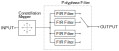

# APSK (Amplitude Phase Shift Keying) Modulator RTL Module

A generic APSK modulator engine, supporting one to eight bits per sample.  Designed to form part of a DVB-S2X transmitter.

## Architecture

A diagram of the APSK modulator architecture is shown below:

The design currently instantiates Xilinx primitive macros although these could be easily changed to another architecture (FPGA or ASIC).

### Modulation Consetallation

The modulation is defined by a lookup table that is loaded though a AXI-stream bus port.  During testing the [DVB-S2X Constellation Definition](../../../python/library/DVB-S2X_constellations.json) is used to populate the lookup table.  In normal operation this will be loaded from a processor such as a Zynq's ARM core.

### Pulse Shaping Filter

The pulse shaping filter coefficients are also loaded through a AXI-stream bus port.  In normal operation this will be loaded from a processor such as a Zynq's ARM core.

### Cofiguration Register

A configuration register using a AXI-lite bus port is used to define the following settings:
- samples per symbol
- symbol offset (not currently implemented)

## TODO

- Symbol offset to support OQPSK/MSK/GMSK is not currently implemented
